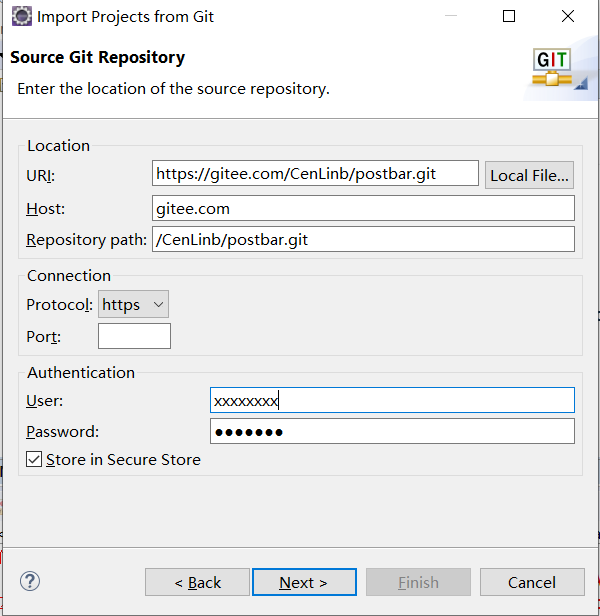
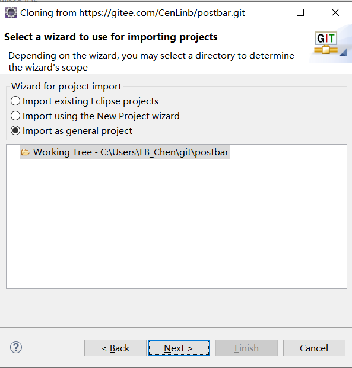
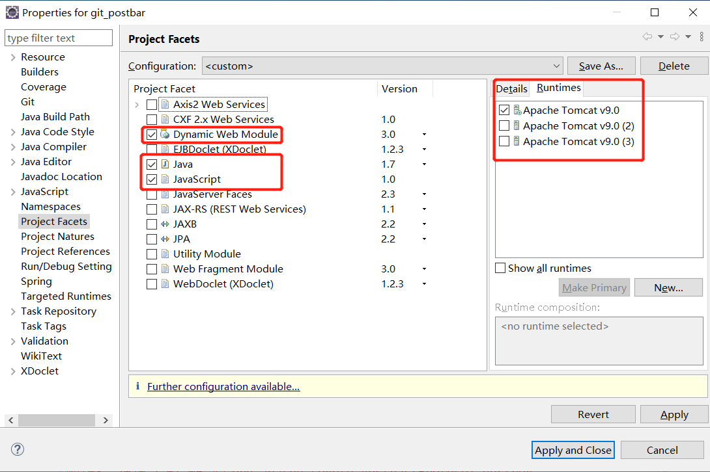

### A Course Design

##### 食用方式

##### 1、eclipse —— file —— import —— git —— project from git —— clone URI —— URI ：https://gitee.com/CenLinb/postbar.git，输入gitee 的 User,Password

##### 2、右键项目 —— Propreties —— Project Facets

##### 3、启动tomcat，浏览器： http://localhost:8080/项目名xxx/ 